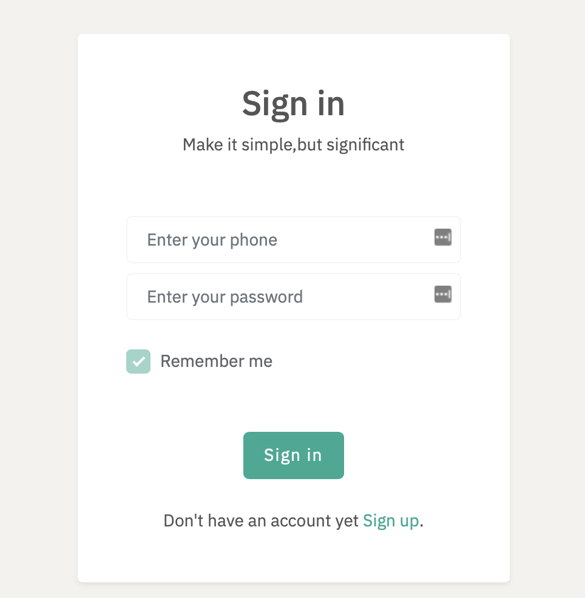
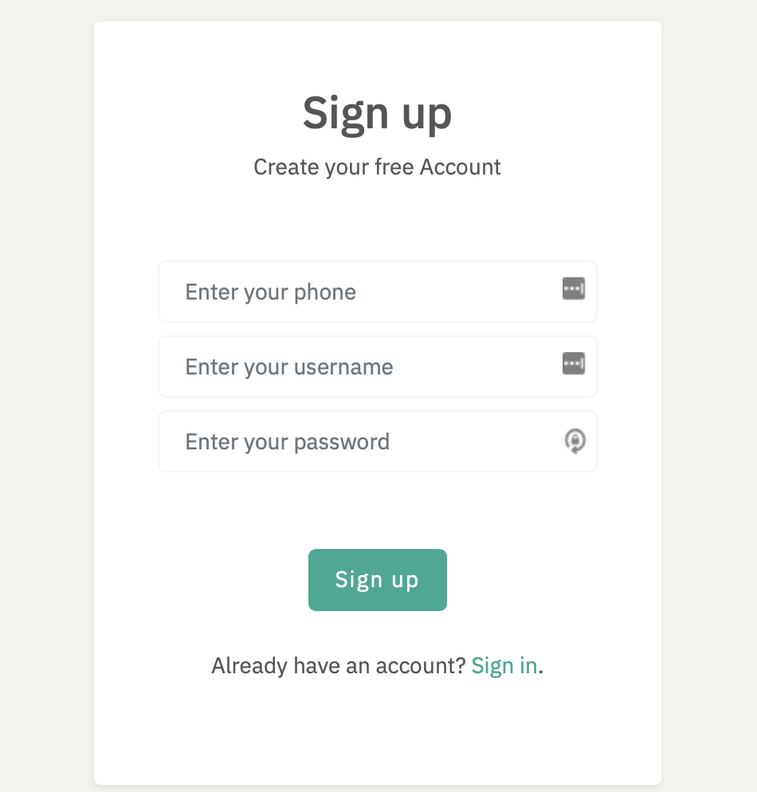
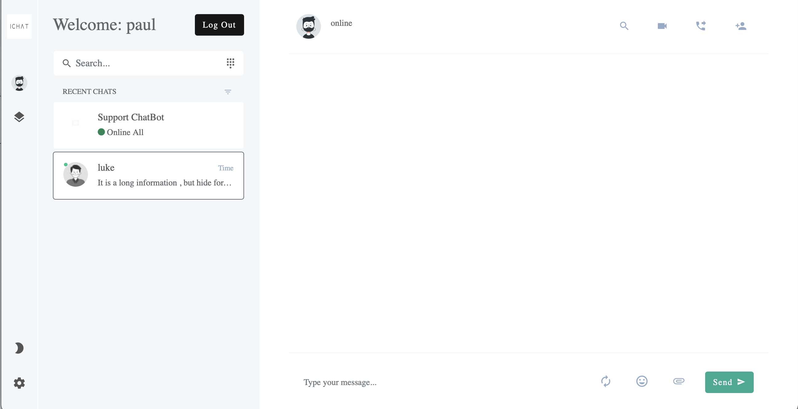
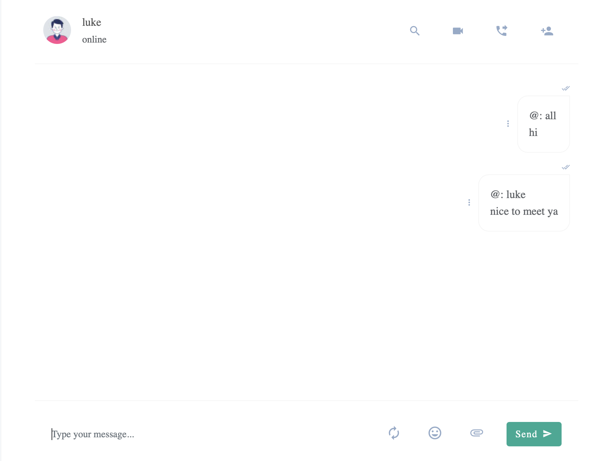
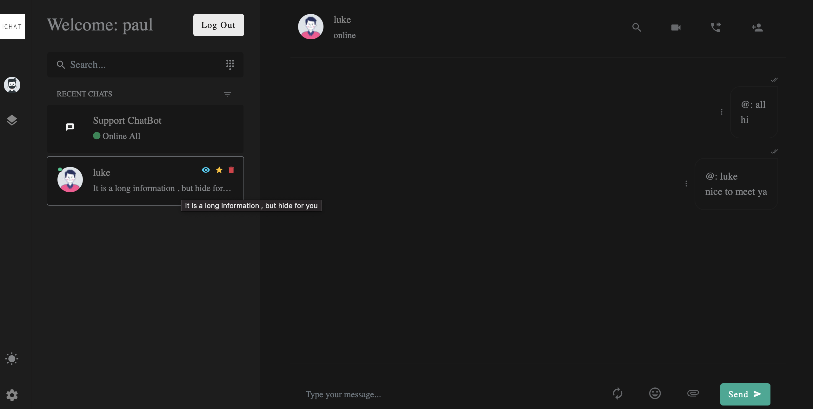

# iChat聊天室

### 一款基于socket通信的聊天软件

## 功能特点   
- [] 前后端分离聊天室      
- [] 页面优雅简洁
- [] 双端加密通信
- [] 群聊功能
-   []  暗黑模式
-  [X] 离线消息
-  [X] 消息备份
-  [X] 发送文件


## 页面截图
#### 登录页面


#### 注册页面


#### 主界面


#### 发送信息示例


#### 黑夜模式


## 环境要求


```
 PHP + Swoole + Redis + Nginx
```

### 后端操作

  单文件运行  `swoole_redis_chatroom.php`      
 
     